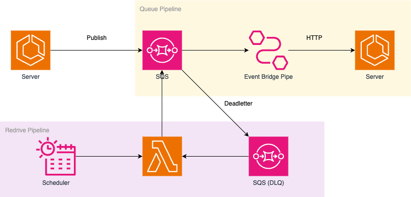

# Well SQS Architecture



## 장점

- SQS Consume 부분에서 HTTP로 질의 (AWS SDK Dependency 감소)
- Circuit Breaker 구성 (Event Bridge Pipe 활성화)
- Cron 시간을 사용하여 Redirve 구성

## Server 

- StatusCode 200 : Success
- StatusCode 400-500 : Failed (DQL로 구성)

## Lambda 

```sh
main.go 참조
```